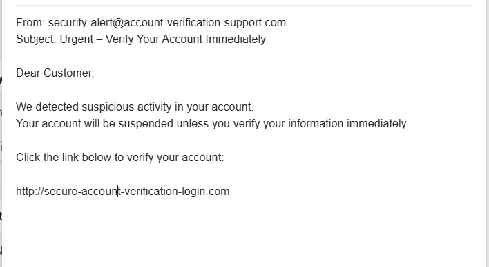

# Task 2 – Phishing Email Detection & Awareness

## Objective
The objective of this task is to analyze phishing emails and identify common phishing indicators. The goal is to understand how attackers use social engineering techniques to trick users into revealing sensitive information.

---

## Tools Used
- Phishing email samples
- Email Header Analyzer
- Browser Tools (for checking links and domains)
- Google Docs / PDF (for documentation)

---

## Sample Phishing Email

From: security-alert@account-verification-support.com  
Subject: Urgent – Verify Your Account Immediately  

Dear Customer,

We detected suspicious activity in your account.  
Your account will be suspended unless you verify your information immediately.

Click the link below to verify your account:

http://secure-account-verification-login.com

Failure to verify your account within 24 hours will result in permanent suspension.

Thank you,  
Security Team

---

## Phishing Indicators Identified

### 1. Suspicious Sender Address
The sender email uses a fake domain that does not belong to any official organization.

---

### 2. Urgent or Fear-Based Language
The email pressures the user to act quickly by threatening account suspension.

---

### 3. Suspicious Link
The URL provided does not belong to a legitimate website and may redirect to a fake login page.

---

### 4. Generic Greeting
The email uses "Dear Customer" instead of addressing the user personally.

---

### 5. Fake Domain Name
The domain used looks similar to real websites but is actually malicious.

---

## Risk Classification

| Email Type | Classification |
|------|------|
| Account Verification Email | Phishing |

This email contains multiple phishing indicators and is classified as a phishing attack.

---

## Attack Explanation

Phishing is a type of social engineering attack where attackers trick users into providing sensitive information.

Attack Process:
1. Attacker sends a fake email pretending to be a trusted organization  
2. Email includes malicious link  
3. User clicks link and enters credentials  
4. Attacker steals data  

---

## Evidence (Screenshot)

---

## Prevention Guidelines

### For Users
- Verify sender email address  
- Avoid clicking unknown links  
- Do not share sensitive information  
- Report suspicious emails  

### For Organizations
- Implement email filtering systems  
- Enable Multi-Factor Authentication (MFA)  
- Conduct security awareness training  
- Monitor suspicious activity  

---

## Awareness Tips

### Do's
- Check sender domain  
- Hover over links  
- Use official websites  

### Don'ts
- Do not click unknown links  
- Do not download attachments  
- Do not share personal data  

---

## Analysis Approach

1. Examined sender email domain  
2. Checked URL structure  
3. Identified social engineering techniques  
4. Classified risk level  

---

## Conclusion

This task helped in understanding phishing attacks and how to detect them. By identifying phishing indicators and following security practices, users can prevent such attacks and protect sensitive information.
